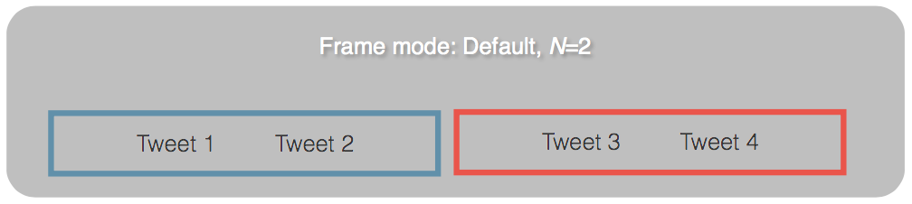
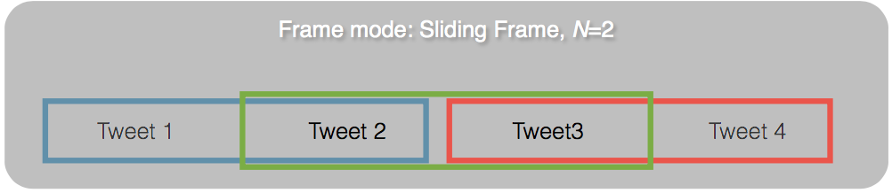
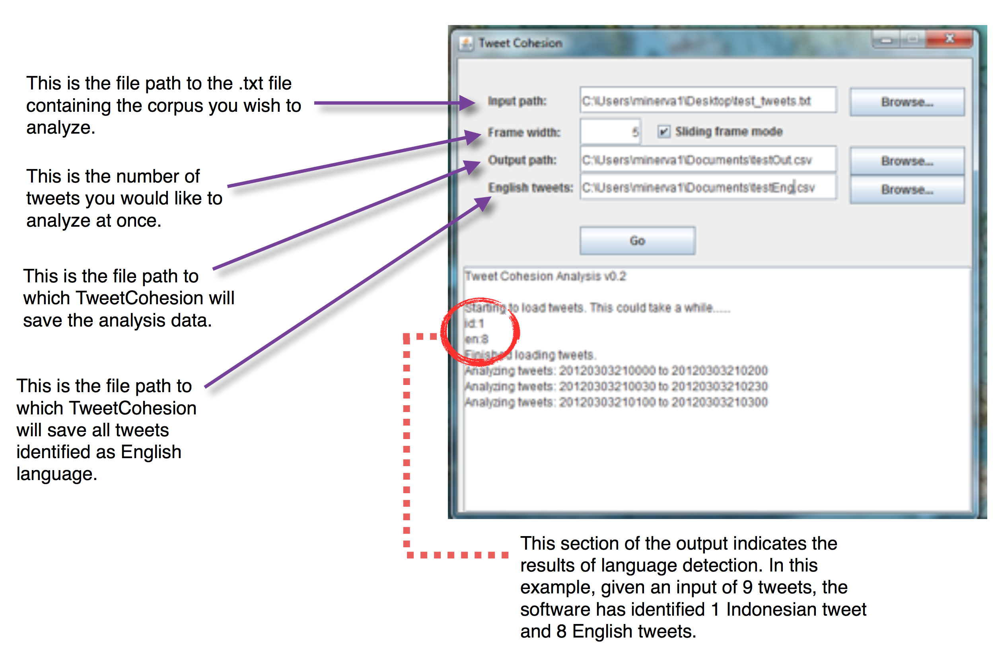

# Tweet Cohesion Tool

## Overview
The Tweet Cohesion software is a tool for analyzing the linguistic cohesion over time of tweet corpora. Currently, the software generates cohesion scores based on content word overlap.

The system takes as an input a corpus of tweets formatted into plaintext. Each line of the text file should contain a 14 character timestamp (YYYYMMDDhhmmss), followed by a space, followed by the text of the individual tweet. An example is as follows:

```
20141110123015 This is an example tweet
20141110151437 This is another such tweet
```

The system then identifies the languages of all tweets, saves the tweets identified as English language to a separate file, and outputs a cohesion analysis on the English tweets. Each line of the output is generated by analyzing a single, arbitrarily-sized “frame” of tweet text. This frame can operate in default mode, or “sliding frame” mode. In the default mode, a frame of size N considers first tweets 1 to N-1, then tweets N to 2N-1, and so on. This behavior is illustrated below:



In this example, two lines of output will be generated. If the number of tweets in the corpus is not evenly divisible by the selected frame width, the remainder will be analyzed as its own frame, regardless of width.

In sliding frame mode, the system analyzes each successive group of N tweets until the last tweet in the corpus is included in a frame. Consider the previous example in sliding frame mode:


In this example, three lines of output will be generated. 

## User Interface


